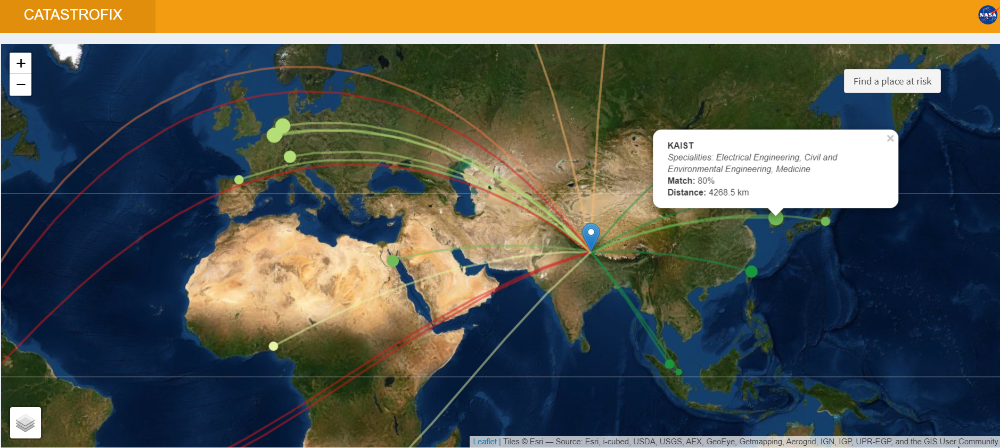
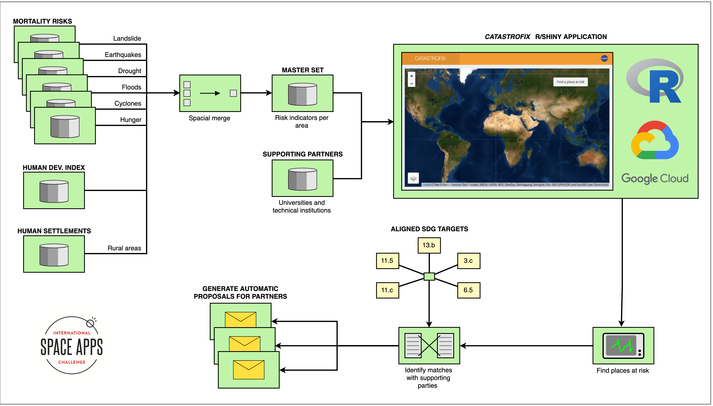

# CatastroFix

### By Team _Space Cake_

_A project by Emelie Hofland and Jaime González-Arintero for the [NASA Space Apps Challenge 2019](https://2019.spaceappschallenge.org/locations/berlin-germany/) in Berlin, on October 18-20, 2019._

## Introduction

_"[Smashing SDGs](https://2019.spaceappschallenge.org/challenges/living-our-world/smash-your-sdgs) by automatically matching places that need help with people that can help."_

**CatastroFix** finds remote human settlements with high risk of natural disasters by means of NASA satellite data. Then, it looks for partners that could help local communities to become more resilient to such risks. Finally, it generates proposals aligned with the targets of the [Sustainable Development Goals](https://www.undp.org/content/undp/en/home/sustainable-development-goals.html).

**The video pitch is available in YouTube.** Just click on the picture below.

## Live demo

A **live demo of the application**, hosted in Google Cloud, is available [**here**](http://35.234.111.112:4321).

## Solution Architecture

## Data sets

**NOTE:** Some of the following data sets have been **converted from [ESRI ASCII raster format](http://resources.esri.com/help/9.3/arcgisengine/java/GP_ToolRef/spatial_analyst_tools/esri_ascii_raster_format.htm) to [shapefiles](https://en.wikipedia.org/wiki/Shapefile)**. A detailed explanation of the conversion procedure can be found in the [next section](https://github.com/Emelieh21/catastrofix-nasa-space-apps#esri-ascii-raster-to-shapefile-conversion).

### Global earthquake mortality risks and distribution

* Converted data set (in this repository): [`data/gdpgamrt-earthquake`](data/gdpgamrt-earthquake)
* Raw source: [NASA SEDAC, Columbia University](https://sedac.ciesin.columbia.edu/data/set/ndh-earthquake-mortality-risks-distribution)

### Global drought mortality risks and distribution

* Converted data set (in this repository): [`data/gddrgmrt-drought`](data/gddrgmrt-drought)
* Raw source: [NASA SEDAC, Columbia University](https://sedac.ciesin.columbia.edu/data/set/ndh-drought-mortality-risks-distribution)

### Global flood mortality risks and distribution

* Converted data set (in this repository): [`data/gdfldmrt-flood`](data/gdfldmrt-flood)
* Raw source: [NASA SEDAC, Columbia University](https://sedac.ciesin.columbia.edu/data/set/ndh-flood-mortality-risks-distribution)

### Global landslide mortality risks and distribution

* Converted data set (in this repository): [`data/gdlndmrt-landslide`](data/gdlndmrt-landslide)
* Raw source: [NASA SEDAC, Columbia University](https://sedac.ciesin.columbia.edu/data/set/ndh-landslide-mortality-risks-distribution)

### Global cyclone mortality risks and distribution

* Converted data set (in this repository): [`data/gdcycmrt-cyclone`](data/gdcycmrt-cyclone)
* Raw source: [NASA SEDAC, Columbia University](https://sedac.ciesin.columbia.edu/data/set/ndh-cyclone-mortality-risks-distribution)

### Subnational human development index

* Data set (in this repository): [`data/GDL-SHDI-SHP-2-human-development-index`](data/GDL-SHDI-SHP-2-human-development-index)
* Raw source: [Global Data Lab, Institute for Management Research, Radboud University](https://globaldatalab.org/shdi/shapefiles/)

### Global rural-urban mapping (human settlements)

* Data set (in this repository): [`data/gl_grumpv1_ppoints_shp-settlements`](data/gl_grumpv1_ppoints_shp-settlements)
* Raw source: [NASA SEDAC, Columbia University](https://sedac.ciesin.columbia.edu/data/collection/grump-v1)

### Database of universities and technical institutes

A [minimal database](assets/db-universities-and-tech-institutes.csv) has been created so the application can match the areas at risk with the potential help sources. **Such database has been compiled as a `.csv` file, and includes some universities and institutes of technology from all over the world.** Although the names, addresses and specialities are real, **the contact persons and their titles are fictional** (for privacy reasons).

The columns `drought`, `flood`, `hunger.medical` and `natural.disasters` indicate if each institution could effectively provide assistance in those emergency situations. For example, a `TRUE` in `hunger.medical` would mean that the institution in particular can support population suffering from hunger and/or in need of medical assistance. However, a `FALSE` in `flood` would mean that the institution doesn't count with enough resources or the right speciality to support flooded areas.

## ESRI ASCII raster to shapefile conversion

**ATTENTION: Although all commands work, this section is a work in progress and still needs to be reviewed.**

### Installation and configuration

The tool `gdal` is required for the format conversion, available via Anaconda or Miniconda.

1. To get started, download the Miniconda install script.

2. Install Miniconda running the provided script:

		sh Miniconda3-latest-MacOSX-x86_64.sh

3. Close terminal, and open a new one, so the new aliases are available.

4. Install `gdal` using the `conda` package manager:

		conda install -c conda-forge gdal

5. Create a `conda` environment; in this case it's named "_CONVERSION_":

		conda create --yes --channel conda-forge --name CONVERSION gdal

6. Activate it:

		conda activate CONVERSION

7. Finally, `gdal` can be imported in Python:

		python -c 'import gdal;print(dir(gdal))'

### Conversion

Files can now be converted innvoking `gdal` from the `conda` environment, by means of the `gdal_polygonize.py` tool:

    gdal_polygonize.py -f "ESRI Shapefile" input-esri-ascii.asc output-shapefile.shp
    
The output shapefiles can now be easily imported in R.

**NOTE:** Data sets that required pre-processing have already been converted, and their shapefiles can be found in the ["data sets" section](https://github.com/Emelieh21/catastrofix-nasa-space-apps#data-sets).

## Running the application locally

### Installation

1. First of all, **install R** from the official source, depending on your operating system:

 * [Windows](https://cran.r-project.org/bin/windows/)
 * [OS X](https://cran.r-project.org/bin/macosx/)
 * [Linux](https://cran.r-project.org/bin/linux/)

2. Once ready, **install RStudio**, since it will be needed to run the app. Simply choose one of the [official installers](https://www.rstudio.com/products/rstudio/download/#download).

3. Clone this repository to your machine (or skip this step if it was already done):

		git clone https://github.com/Emelieh21/catastrofix-nasa-space-apps.git

4. Open RStudio, and **run the following command** on the console window (at the bottom left corner) to install the required packages:

		install.packages(c("shiny","shinydashboard","leaflet","dplyr","geosphere","rgeos","RColorBrewer", "readxl"))
		
	**NOTE:** This could take a few minutes, as the packages must be compiled for the target system.

### Usage

1. Head to the folder of the tool, where the repository was cloned, (e.g. `/Downloads/catastrofix-nasa-space-apps`).

2. Open the file `app.R` with RStudio.

3. Click on **"Run App"** (small green "play" button).

<!--

## Hosting the application in Google Cloud

### System configuration

**IMPORTANT:** The GEOS library (`libgeos`) is required for one of the used R packages (`rgeos`). Thus, it must be installed upfront. Otherwise R will fail to install all the required packages. This can be done with the following command:

    sudo apt-get install libgeos++-dev

Once ready, install R

### Installing R

1. Once ready, to install R run:

		

2. Open R:

3. To install all required packages, execute:

		install.packages(c("shiny","shinydashboard","leaflet","dplyr","geosphere","rgeos","RColorBrewer", "readxl"))

### Launching the application

Once the repository has been cloned, head to its folder:

    cd catastrofix-nasa-space-apps

Now open the R interpreter on the VM with the command:

    R
    
A session will open; the application can now be _served_ with:

    shiny::runApp(host="[INTERNAL_IP_ADDRESS]",port=[PORT])

For example, for this specific instance, the command was:

    shiny::runApp(host="10.156.0.2",port=4321)

TO DOCUMENT:
    nano run.R
    Rscript run.R

### Usage

Once the application is up and running in the Google Cloud Compute Engine VM instance, it can be accessed from any device in the world, under a URL with the format: `http://[EXTERNAL_IP_ADDRESS]:[PORT]`

For example, this particular instance can be accessed from:
[`http://35.234.111.112:4321`](http://35.234.111.112:4321)

-->

## To do

* Add hunger dataset to the docs.
* Finish documenting the deployment in Google Cloud.
* Review the data conversion section.

## License

Copyright (C) 2019 Emelie Hofland <emelie_hofland@hotmail.com>, Jaime González-Arintero <a.lie.called.life@gmail.com>

Permission is hereby granted, free of charge, to any person obtaining a copy of this software and associated documentation files (the "Software"), to deal in the Software without restriction, including without limitation the rights to use, copy, modify, merge, publish, distribute, sublicense, and/or sell
copies of the Software, and to permit persons to whom the Software is furnished to do so, subject to the following conditions:

The above copyright notice and this permission notice shall be included in all copies or substantial portions of the Software.

Except as contained in this notice, the name(s) of the above copyright holders shall not be used in advertising or otherwise to promote the sale, use or
other dealings in this Software without prior written authorization.

THE SOFTWARE IS PROVIDED "AS IS," WITHOUT WARRANTY OF ANY KIND, EXPRESS OR IMPLIED, INCLUDING BUT NOT LIMITED TO THE WARRANTIES OF MERCHANTABILITY,
FITNESS FOR A PARTICULAR PURPOSE AND NONINFRINGEMENT.  IN NO EVENT SHALL THE AUTHORS OR COPYRIGHT HOLDERS BE LIABLE FOR ANY CLAIM, DAMAGES OR OTHER
LIABILITY, WHETHER IN AN ACTION OF CONTRACT, TORT OR OTHERWISE, ARISING FROM, OUT OF OR IN CONNECTION WITH THE SOFTWARE OR THE USE OR OTHER DEALINGS IN THE
SOFTWARE.